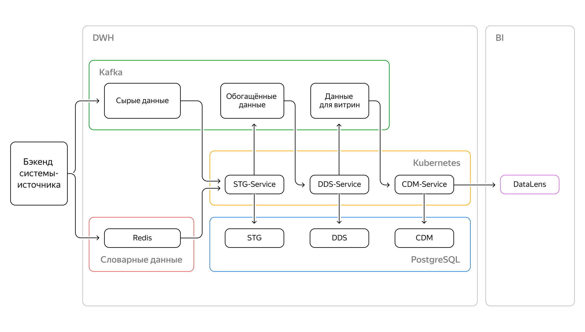

# Микросервисная архитектура

## *Бизнес требования*
Разработать облачный DWH для тегирования пользователей приложения - для повышения эффективности рекламных акций.
Маркетинг будет проводить кампании, заточенные под гостей с определённым тегом. Все расчёты ведутся только по заказам со
статусом CLOSED. В каждом заказе есть категория. Для этих категорий будут заведены счётчики с конкретными порогами. При
превышении порога гостю записывается тег.

## Функциональные требования
### Входные данные: 
1. Информация по заказам — это потоковые данные, которые будут передаваться через брокер сообщений в
формате JSON.
2. Справочные данные — извлекаются из хранилища ключ-значение.

### Выходные данные: 
- Первая витрина — счётчик заказов по блюдам; 
- вторая — счётчик заказов по категориям товаров.

## Нефункциональные требования
- Нагрузка на систему заказов — 5 заказов в минуту.  
- На старте загрузят историю за неделю — 50 000 заказов сразу.
- Обеспечить идемпотентность обработки сообщений из брокера.
- Суммарный бюджет на весь проект не должен превышать 5000 рублей в месяц.
- Использовать технологии, которые позволят легко масштабировать сервис в будущем.
- Нужно оставить возможность переходить из одного облака в другое.


## Schema 

## Технологии

- Kafka - брокер сообщений
- Redis - хранение справочных данных
- PostgreSQL - DWH
- YandexCloud - облачный провайдер
- DataLens - визуализация данных
- Python - обработка данных
- Kubernetes - назначение сервисов

## Описание данных

### Staging-слой (STG)
STG Слой с исходными данными as is — источник правды.
### Detail Data Store (DDS)
DDS Слой детализированных данных для сбора в удобном для управления виде.
Модель DDS Data Vault.
### Common Data Marts (CDM)
CDM Общие витрины для заказчика.

## Логика работы сервисов
### STG-Service
#### Пример входного сообщения из order-service_orders

```json
{
  "object_id": 1371198,
  "object_type": "order",
  "sent_dttm": "2023-04-08 20:27:36",
  "payload": {
    "restaurant": {
      "id": "ef8c42c19b7518a9aebec106"
    },
    "date": "2023-04-01 20:45:43",
    "user": {
      "id": "626a81ce9a8cd1920641e29c"
    },
    "order_items": [
      {
        "id": "aeca4d08abab78869c20128c",
        "name": "Рис с лимоном",
        "price": 175,
        "quantity": 5
      }
    ],
    "bonus_payment": 0,
    "cost": 875,
    "payment": 875,
    "bonus_grant": 0,
    "statuses": [
      {
        "status": "CLOSED",
        "dttm": "2023-04-01 20:45:43"
      },
      {
        "status": "DELIVERING",
        "dttm": "2023-04-01 20:12:14"
      },
      {
        "status": "COOKING",
        "dttm": "2023-04-01 19:14:45"
      },
      {
        "status": "OPEN",
        "dttm": "2023-04-01 18:55:52"
      }
    ],
    "final_status": "CLOSED",
    "update_ts": "2023-04-01 20:45:43"
  }
}
```
#### Пример выходного сообщения в stg-service-orders
```json
{
  "object_id": 322519,
  "object_type": "order",
  "payload": {
    "id": 322519,
    "date": "2022-11-19 16:06:36",
    "cost": 300,
    "payment": 300,
    "status": "CLOSED",
    "restaurant": {
      "id": "626a81cfefa404208fe9abae",
      "name": "Кофейня №1"
    },
    "user": {
      "id": "626a81ce9a8cd1920641e296",
      "name": "Котова Ольга Вениаминовна"
    },
    "products": [
      {
        "id": "6276e8cd0cf48b4cded00878",
        "price": 180,
        "quantity": 1,
        "name": "РОЛЛ С ТОФУ И ВЯЛЕНЫМИ ТОМАТАМИ",
        "category": "Выпечка"
      }
    ]
  }
}
```

### DDS-Service
#### Пример входного сообщения из stg-service-orders

```json
{
  "object_id": 322519,
  "object_type": "order",
  "payload": {
    "id": 322519,
    "date": "2022-11-19 16:06:36",
    "cost": 300,
    "payment": 300,
    "status": "CLOSED",
    "restaurant": {
      "id": "626a81cfefa404208fe9abae",
      "name": "Кофейня №1"
    },
    "user": {
      "id": "626a81ce9a8cd1920641e296",
      "name": "Котова Ольга Вениаминовна"
    },
    "products": [
      {
        "id": "6276e8cd0cf48b4cded00878",
        "price": 180,
        "quantity": 1,
        "name": "РОЛЛ С ТОФУ И ВЯЛЕНЫМИ ТОМАТАМИ",
        "category": "Выпечка"
      }
    ]
  }
}
```

#### Пример выходного сообщения в cdm-service-stats

```json
[
  {
    "user_id": "47044875-5c7b-448e-830a-bc6d13fe11da",
    "product_id": "b7d5264c-2b37-4666-be51-23f80756892c",
    "product_name": "Салат Тбилисо",
    "category_id": "8690bd24-85e0-4eab-8091-26c81995cd1c",
    "category_name": "Салаты",
    "order_cnt": 1
  }
]
```


### CDM-Service
#### Пример входного сообщения из cdm-service-stats

```json
[
  {
    "user_id": "47044875-5c7b-448e-830a-bc6d13fe11da",
    "product_id": "b7d5264c-2b37-4666-be51-23f80756892c",
    "product_name": "Салат Тбилисо",
    "category_id": "8690bd24-85e0-4eab-8091-26c81995cd1c",
    "category_name": "Салаты",
    "order_cnt": 1
  }
]
```

## Dashboard


